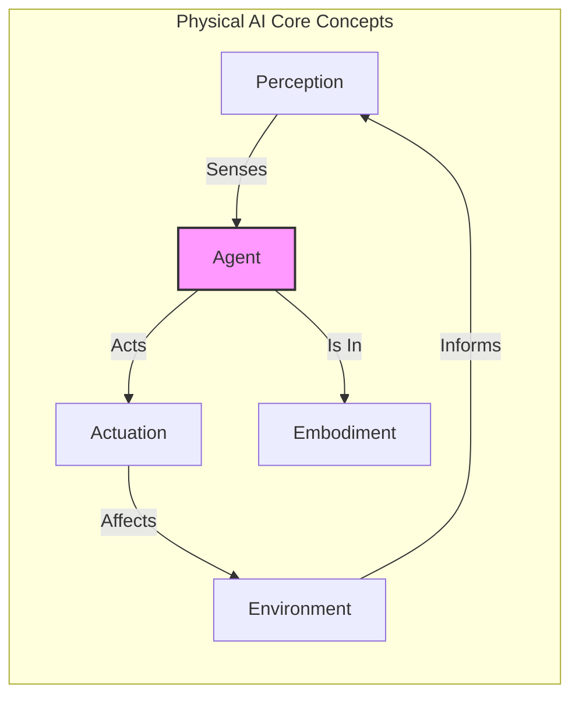

# Chapter 2: Physical AI Basics


Physical AI refers to the integration of artificial intelligence with physical systems, enabling machines to perceive, reason, and act in the real world. Unlike purely software-based AI, Physical AI systems interact with their environment through sensors and actuators, allowing them to perform tasks that require physical manipulation, navigation, and interaction.

## Core Concepts of Physical AI

### Embodiment
The concept of embodiment in Physical AI emphasizes that intelligence is not solely a product of abstract computation but is deeply intertwined with the physical body and its interactions with the environment. An embodied AI system has a physical form (a robot, a drone, etc.) and uses its body to perceive and influence the world.

### Perception
Physical AI systems rely on a variety of sensors to perceive their surroundings. These can include:
- **Vision Sensors:** Cameras for object recognition, depth perception, and navigation.
- **Haptic Sensors:** Touch sensors for detecting contact, pressure, and texture.
- **Proprioceptive Sensors:** Sensors that provide information about the robot's own body state, such as joint angles and motor speeds.
- **Auditory Sensors:** Microphones for sound detection and speech recognition.

### Actuation
Actuation is the ability of a Physical AI system to act upon its environment. This is achieved through actuators such as:
- **Motors:** For movement of limbs, wheels, or propellers.
- **Grippers/Manipulators:** For grasping and manipulating objects.
- **Pneumatic or Hydraulic Systems:** For powerful and precise movements.

### Control and Navigation
Physical AI systems require sophisticated control algorithms to manage their movements and navigate complex environments. This often involves:
- **Path Planning:** Determining an optimal route to a destination while avoiding obstacles.
- **Motion Control:** Executing planned movements smoothly and accurately.
- **Localization:** Determining the system's precise position within its environment.
- **Mapping:** Creating and updating a representation of the environment.



## Applications of Physical AI
Physical AI is being applied across a wide range of industries and domains, transforming how we interact with technology and the physical world.

### Robotics
The most obvious application of Physical AI is in robotics. This includes:
- **Industrial Robots:** For manufacturing, assembly, and logistics.
- **Service Robots:** For tasks in healthcare, hospitality, and domestic environments.
- **Exploration Robots:** For hazardous environments, space exploration, and underwater research.
- **Humanoid Robots:** Designed to mimic human form and interaction.

### Autonomous Vehicles
Physical AI is at the heart of autonomous vehicles, including self-driving cars, drones, and delivery robots. These systems use a combination of sensors, AI algorithms, and control systems to navigate roads, skies, and challenging terrains without human intervention.

### Smart Manufacturing and Logistics
In smart factories and warehouses, Physical AI-powered systems optimize production lines, manage inventory, and automate material handling, leading to increased efficiency and reduced operational costs.

### Healthcare
Physical AI applications in healthcare range from surgical robots that assist with precision operations to prosthetic limbs that can be controlled with thought, and companion robots that provide assistance to the elderly.

### Agriculture
Autonomous tractors, drones for crop monitoring, and robotic harvesters are examples of Physical AI transforming modern agriculture, enhancing productivity and sustainability.

| Domain | Application Examples | Key Physical AI Contribution |
| :--- | :--- | :--- |
| **Robotics** | Industrial Arms, Service Robots | Manipulation, Navigation, Human Interaction |
| **Autonomous Vehicles** | Self-Driving Cars, Drones | Real-time navigation, obstacle avoidance |
| **Healthcare** | Surgical Robots, AI Prosthetics | Precision movement, responsive assistance |
| **Agriculture** | Automated Tractors, Crop Drones | Environmental perception, automated tasks |

## Hybrid AI Examples
Many real-world AI systems combine physical components with sophisticated software-based AI, forming hybrid AI systems.

### Human-Robot Collaboration (Cobots)
Cobots are designed to work alongside humans in shared workspaces. These hybrid systems leverage the strengths of both humans (cognitive abilities, flexibility) and robots (precision, strength, endurance) to perform tasks more efficiently and safely.

### Augmented Reality (AR) and Robotics
AR can provide humans with enhanced perception and guidance when operating physical robots. For example, an AR overlay might show a robot's planned path or highlight objects it needs to interact with, blending digital information with the physical world.

### AI-Powered Prosthetics and Exoskeletons
Advanced prosthetics and exoskeletons use AI to interpret user intentions (e.g., muscle signals, brain activity) and translate them into precise physical movements. These hybrid systems restore or enhance physical capabilities, demonstrating a deep integration of AI with the human body.

### Intelligent Infrastructure
Smart cities utilize hybrid AI to manage traffic flow, optimize energy consumption, and monitor public safety. Sensors embedded in the physical environment collect data, which AI systems then analyze to make real-time decisions and control various urban systems.

### Disaster Response Robots
Robots equipped with AI are deployed in disaster zones to assess damage, search for survivors, and perform hazardous tasks that are too dangerous for humans. These systems often operate autonomously but can also be teleoperated by humans, forming a hybrid human-in-the-loop control system.

Physical AI is an evolving field that promises to bring increasingly intelligent and capable machines into our daily lives, blurring the lines between the digital and physical worlds.

## Code Example: The Perception-Action Loop

The core of any Physical AI system is the **perception-action loop**. The robot perceives its environment, decides on an action, and then executes it. This loop runs continuously, allowing the robot to react dynamically to changes.

```python
# Simple pseudo-code for a perception-action loop in a robot

class SimpleRobot:
    def __init__(self):
        # Mock sensors and actuators
        self.camera = "CAMERA_SENSOR"
        self.motor = "MOTOR_ACTUATOR"
        self.is_running = True

    def perceive(self):
        """Senses the environment."""
        # In a real robot, this would read data from a camera
        print("Perceiving: Looking for obstacles...")
        # Mocking a sensor reading: returns True if an obstacle is detected
        import random
        return random.choice([True, False])

    def decide(self, obstacle_detected):
        """Makes a decision based on perception."""
        if obstacle_detected:
            print("Decision: Obstacle detected! Must turn.")
            return "TURN"
        else:
            print("Decision: Path is clear. Move forward.")
            return "FORWARD"

    def act(self, action):
        """Executes the chosen action."""
        if action == "TURN":
            print(f"Action: Engaging {self.motor} to turn away from obstacle.\n")
        elif action == "FORWARD":
            print(f"Action: Engaging {self.motor} to move forward.\n")

    def run_loop(self):
        """Main loop of the robot's operation."""
        while self.is_running:
            # 1. Perceive the world
            obstacle_found = self.perceive()
            
            # 2. Decide what to do
            chosen_action = self.decide(obstacle_found)
            
            # 3. Act on that decision
            self.act(chosen_action)
            
            # In a real robot, there would be a delay here
            import time
            time.sleep(2)
            # For this example, we'll just run a few cycles
            if random.random() < 0.1: # 10% chance to stop
                self.is_running = False
                print("Robot is shutting down.")

# --- Main Program ---
if __name__ == "__main__":
    robot = SimpleRobot()
    robot.run_loop()

```
---