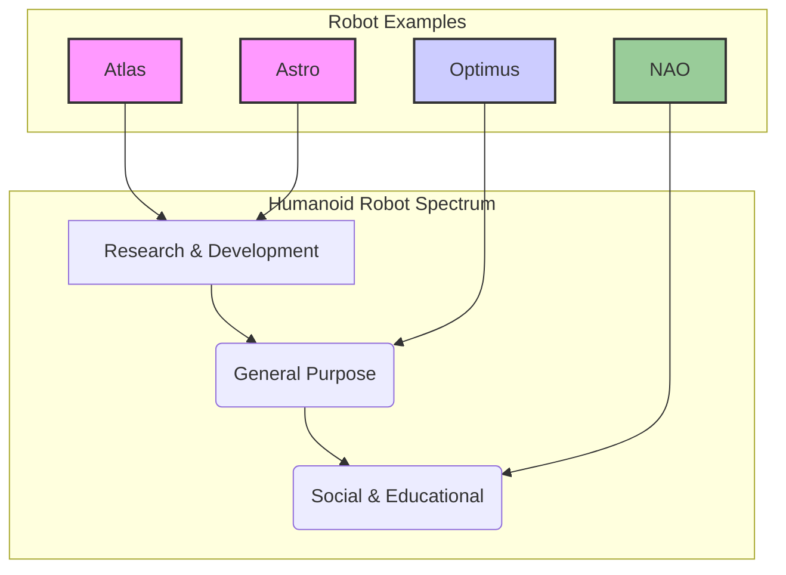

# Chapter 3: Humanoid Robot Types

Humanoid robots are advanced machines designed to mimic the human form and often human movements. They are developed for various purposes, from research and assistance to exploration and entertainment. This chapter provides an overview of some prominent humanoid robots, highlighting their unique features and applications.

## Comparison of Humanoid Robots

| Robot | Primary Use Case | Key Feature | Power System |
| :--- | :--- | :--- | :--- |
| **Atlas** | Advanced R&D | Extreme Mobility & Parkour | Hydraulic |
| **Optimus** | General-Purpose Labor | AI & Mass Producibility | Electric |
| **NAO** | Education & HRI | Social Interaction | Electric |
| **Astro** | Agile Locomotion R&D | Dynamic Movement | Electric |

---

## Boston Dynamics Atlas

**Developer:** Boston Dynamics
**Primary Focus:** Research and Development, specifically pushing the limits of whole-body mobility and dynamic balance.

Atlas is one of the most iconic and dynamically capable humanoid robots in the world. It is not designed for a specific commercial purpose but rather as a research platform to explore and test advanced control and perception systems.

**Key Features:**
-   **Hydraulic Actuation:** Unlike most electric humanoids, Atlas uses a powerful hydraulic system, allowing it to generate immense force for explosive movements like jumping, flipping, and lifting heavy objects.
-   **Advanced Control Algorithms:** It employs sophisticated real-time control software that combines perception data with models of its own body dynamics to achieve fluid and resilient motion.
-   **Parkour and Dance:** Boston Dynamics often showcases Atlas performing complex parkour courses or dancing, demonstrating its ability to execute long, complex sequences of high-energy movements.

## Tesla Optimus (Figure 01)

**Developer:** Tesla, Inc.
**Primary Focus:** General-purpose autonomous work in manufacturing and eventually, everyday life.

Tesla's entry into humanoid robotics, Optimus, is driven by the goal of creating a mass-produced, affordable, and highly capable robot worker. The vision is for Optimus to handle tasks that are "dangerous, repetitive, or boring" for humans.

**Key Features:**
-   **AI-First Design:** Leverages Tesla's extensive experience with AI from its self-driving car program, particularly in computer vision and decision-making.
-   **Electric Actuators:** Designed with custom electric motors and actuators optimized for efficiency and cost-effective production.
-   **Human-like Hands:** A major focus is on developing dexterous hands capable of manipulating a wide variety of tools and objects, a crucial skill for general-purpose work.

## SoftBank Robotics NAO

**Developer:** SoftBank Robotics (formerly Aldebaran Robotics)
**Primary Focus:** Education, research, and human-robot social interaction.

NAO is a smaller, more approachable humanoid that has become a standard platform in universities and research labs worldwide. Its primary strength lies in its ability to interact with people in a friendly and engaging manner.

**Key Features:**
-   **Rich Sensor Suite:** Equipped with multiple cameras, microphones, touch sensors, and sonars, making it highly perceptive of its environment and human interaction.
-   **Programmable and Open:** Comes with a user-friendly software development kit (SDK) that allows students and researchers to easily program complex behaviors.
-   **Expressive Motion:** Designed to be expressive, using its body language and voice to communicate emotions and intentions, making it ideal for social robotics studies.

## Astro

**Developer:** Varies (often a university research project, e.g., University of Illinois)
**Primary Focus:** Research into dynamic locomotion and robust control in challenging environments.

Astro represents a category of research robots that focus on achieving highly agile and animal-like movement within a humanoid or near-humanoid form factor. The name and specific capabilities can differ between research institutions.

**Key Features:**
-   **Proprioceptive Actuation:** Often uses specialized actuators that provide high-fidelity feedback about force and position, allowing for more compliant and reactive control.
-   **Reinforcement Learning:** Astro projects are frequently used to test advanced AI techniques like deep reinforcement learning, where the robot learns to walk or run through trial and error in simulation and then transfers that knowledge to the physical robot.
-   **Resilience:** A key research goal is to create robots that can maintain balance and continue their task even when pushed, shoved, or walking on uneven terrain.

Each of these robots represents a different facet of humanoid robotics research and development, contributing to the broader understanding and application of human-like machines in our world.
