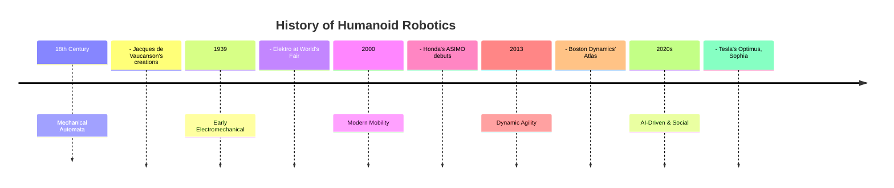

# Chapter 6: History and Evolution of Humanoid Robotics

Humanoid robotics, a field at the intersection of engineering, artificial intelligence, and design, has a rich history spanning centuries, moving from mythological concepts to sophisticated modern machines.



## Early Concepts and Inspirations

The idea of creating machines in the likeness of humans can be traced back to antiquity. Myths and legends from various cultures describe artificial beings with human-like forms and abilities, such as the golem in Jewish folklore or Talos in Greek mythology.

The Renaissance and Enlightenment periods saw the emergence of intricate mechanical automata, particularly in Europe. These devices, often crafted by master clockmakers and inventors like Jacques de Vaucanson (known for his "Digesting Duck" and Flute Player), demonstrated early principles of mechanics and sophisticated design, captivating audiences and laying conceptual groundwork for future robotic endeavors. While not programmable in the modern sense, they embodied the aspiration to replicate human movement and function.

## Pioneering Robots (20th Century)

The 20th century marked the transition from mechanical wonders to electromechanical and, eventually, electronic robots. Early examples often appeared in fiction, shaping public imagination long before practical implementation.

One of the earliest true humanoid robots was "Elektro," unveiled at the 1939 New York World's Fair by Westinghouse. Standing seven feet tall, Elektro could walk, speak about 700 words, and even smoke. These early robots, while impressive for their time, were typically remote-controlled or followed pre-programmed sequences with limited autonomy.

The latter half of the 20th century saw significant advancements in robotics, driven by industrial automation needs. However, the focus remained largely on manipulators and wheeled robots rather than full humanoids. Research into bipedal locomotion and human-like interaction began to gain traction towards the end of the century.

## Modern Humanoids

The late 20th and early 21st centuries have witnessed a surge in humanoid robotics development, propelled by advancements in computing power, sensor technology, artificial intelligence, and materials science. Modern humanoids are designed to interact with human environments, often mimicking human gait, dexterity, and even expressions.

Key milestones and examples include:

*   **Honda ASIMO (Advanced Step in Innovative Mobility)**: Unveiled in 2000, ASIMO became one of the most recognizable humanoids, demonstrating fluid bipedal walking, running, stair climbing, and complex interactions like understanding gestures and recognizing faces. ASIMO's development emphasized mobility and interaction in human living spaces.
*   **Boston Dynamics Atlas**: Known for its remarkable agility and dynamic balancing capabilities, Atlas can perform complex acrobatic feats, navigate challenging terrains, and handle objects. Its development pushes the boundaries of dynamic locomotion and robust control systems.
*   **Sophia (Hanson Robotics)**: A social humanoid robot designed for research in AI and human-robot interaction, Sophia is capable of displaying human-like expressions and engaging in conversations, aiming to explore the potential for companion robots.
*   **Digit (Agility Robotics)**: Designed for logistics and package delivery, Digit focuses on practical applications in human-centric spaces, emphasizing efficient bipedal locomotion and manipulation.

Modern humanoids are increasingly being used in diverse fields, from research and exploration to assistance, entertainment, and even disaster response, demonstrating growing autonomy and adaptability.

## Distinction: Educational vs. Industrial Robots

While all robots serve a purpose, it's crucial to distinguish between educational and industrial robots based on their primary function, design, and operational environment.

| Feature | Educational Robots | Industrial Robots |
| :--- | :--- | :--- |
| **Primary Goal**| Learning & Research | Automation & Production |
| **Design Focus** | Safety, Usability, Modularity | Power, Speed, Durability |
| **Environment** | Classrooms, Labs | Factories, Warehouses |
| **Cost** | Low to Moderate | High |
| **Examples** | LEGO Mindstorms, NAO | FANUC arms, KUKA robots |

The evolution of humanoid robotics continues to accelerate, blurring the lines between these categories as more advanced humanoids find roles in both highly structured industrial settings and dynamic, human-centric environments.

## Code Example: A Python Timeline

This simple Python script uses a dictionary to represent a timeline, making it easy to look up key milestones in the history of humanoid robots.

```python
# A simple Python dictionary to represent a timeline of humanoid robots

humanoid_timeline = {
    "1738": {
        "name": "The Flute Player",
        "creator": "Jacques de Vaucanson",
        "type": "Automaton",
        "significance": "An early mechanical automaton that could play the transverse flute."
    },
    "1939": {
        "name": "Elektro",
        "creator": "Westinghouse",
        "type": "Electromechanical",
        "significance": "One of the first humanoid robots showcased to the public, could speak and move."
    },
    "1973": {
        "name": "Wabot-1",
        "creator": "Waseda University",
        "type": "Full-scale Humanoid",
        "significance": "Considered the first full-scale humanoid robot, could walk and communicate in Japanese."
    },
    "2000": {
        "name": "ASIMO",
        "creator": "Honda",
        "type": "Dynamic Walking",
        "significance": "Demonstrated advanced, fluid bipedal walking and human interaction."
    },
    "2013": {
        "name": "Atlas (Initial Version)",
        "creator": "Boston Dynamics",
        "type": "Dynamic Balance & Agility",
        "significance": "Pushed boundaries of dynamic balance and robust mobility in challenging terrains."
    },
    "2016": {
        "name": "Sophia",
        "creator": "Hanson Robotics",
        "type": "Social Humanoid",
        "significance": "Known for realistic facial expressions and AI-driven conversations."
    }
}

def display_timeline_entry(year):
    if year in humanoid_timeline:
        entry = humanoid_timeline[year]
        print(f"--- Year: {year} ---")
        print(f"  Name: {entry['name']}")
        print(f"  Creator: {entry['creator']}")
        print(f"  Type: {entry['type']}")
        print(f"  Significance: {entry['significance']}")
    else:
        print(f"No entry found for the year {year}.")

if __name__ == "__main__":
    print("A Snapshot of Humanoid Robot History:\n")
    display_timeline_entry("1973")
    print("\n")
    display_timeline_entry("2000")
```
---
