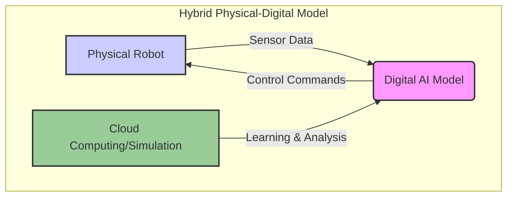

# Chapter 7: Physical AI Principles


## Embodiment and Real-World Learning

Physical AI emphasizes the importance of **embodiment**, meaning that an AI system exists within a physical body and interacts directly with the real world. This direct interaction allows for **real-world learning**, where the AI gathers data and refines its understanding through sensory experiences and actions in a dynamic environment, rather than solely relying on simulated or pre-programmed data.

Key aspects include:
*   **Sensory Perception:** AI systems learn through cameras, touch sensors, microphones, and other physical inputs.
*   **Motor Control:** Learning to manipulate objects, navigate spaces, and perform physical tasks.
*   **Adaptive Behavior:** Adjusting to unexpected changes and uncertainties in the physical environment.

This approach contrasts with purely virtual AI, as embodied AI faces the complexities of physics, unpredictability, and real-time interaction, leading to more robust and generalized intelligence.

## Hybrid Physical-Digital Models

Hybrid physical-digital models combine the strengths of both physical and digital systems. In this paradigm, physical robots (or hardware components) interact with digital AI models (software algorithms, simulations, cloud computing) to achieve tasks.

*   **Physical Component:** The robot or hardware that performs actions and gathers data in the real world. This can include robotic arms, mobile platforms, or even embedded sensors.
*   **Digital Component:** The AI algorithms, neural networks, and computational models that process data, make decisions, and control the physical component. This often involves cloud-based processing for complex computations or large datasets.



This hybrid approach allows for:
*   **Leveraging Simulation:** Using digital simulations to train AI models safely and efficiently before deploying them to physical hardware.
*   **Real-time Adaptation:** Digital models can rapidly analyze physical sensor data to make immediate adjustments.
*   **Remote Control and Updates:** Digital interfaces enable remote operation, monitoring, and over-the-air updates for physical systems.
*   **Data Fusion:** Combining physical sensor data with digital contextual information for richer understanding.

## Examples in Robotics Education

Physical AI principles are becoming foundational in robotics education, offering hands-on learning experiences that bridge theory and practice.

1.  **Robot Arm Manipulation:** Students program robotic arms to pick and place objects, understanding inverse kinematics, computer vision for object detection, and path planning. They learn how errors in sensor data or motor calibration affect real-world performance, directly experiencing embodiment.

2.  **Autonomous Mobile Robots (AMRs):** Students build and program AMRs to navigate classrooms or obstacle courses. This involves learning about SLAM (Simultaneous Localization and Mapping), sensor fusion (lidar, cameras, ultrasonic), and real-time decision-making algorithms for avoiding collisions and reaching targets. The physical interaction highlights challenges like wheel slippage, sensor noise, and unexpected environmental changes.

3.  **Human-Robot Interaction (HRI) with Social Robots:** Educational platforms use social robots to teach HRI concepts. Students program robots to interpret human gestures, facial expressions, and speech, and respond appropriately. This demonstrates the complexities of real-world social cues and the need for robust, adaptive AI.

4.  **Reinforcement Learning for Locomotion:** Students use simulated environments to train virtual robots to walk or run using reinforcement learning. They then deploy these learned policies onto small physical robots (e.g., quadruped robots), observing the "reality gap" and fine-tuning models in the physical domain. This teaches the iterative process of design, simulation, and physical validation inherent in Physical AI.

| Educational Example | Key Physical AI Principles Illustrated |
| :--- | :--- |
| **Robot Arm Manipulation** | Embodiment, Inverse Kinematics, Computer Vision |
| **Autonomous Mobile Robots**| SLAM, Sensor Fusion, Real-time Decision Making |
| **Human-Robot Interaction**| Social Cues, Adaptive Behavior |
| **Reinforcement Learning** | Real-world Learning, Simulation-to-Reality Transfer |

These examples provide practical understanding of how AI systems interact with, learn from, and operate within the physical world, preparing students for careers in robotics, automation, and intelligent systems.

## Code Example: Reinforcement Learning in a Nutshell

The following pseudo-code provides a conceptual look at how a robot might learn a simple task using Q-learning, a form of reinforcement learning. The robot learns to navigate a simple path by being rewarded for reaching the end and penalized for entering a hazard zone.

```python
# Simple pseudo-code for a reinforcement learning concept

import random

# --- Environment Setup ---
# Let's define a simple "world" with a start, an end, and a penalty zone
world = ["START", "EMPTY", "PENALTY", "EMPTY", "END"]
robot_position = 0 # Start at the "START" state

# --- AI Agent (The Robot's Brain) ---
# Q-table: a simple dictionary to store what the agent learns
# It maps (state, action) pairs to a "Q-value" (the expected reward)
q_table = {
    (0, "RIGHT"): 0, (1, "LEFT"): 0, (1, "RIGHT"): 0,
    (2, "LEFT"): 0, (2, "RIGHT"): 0, (3, "LEFT"): 0, (3, "RIGHT"): 0,
}
actions = ["LEFT", "RIGHT"]

# --- Learning Parameters ---
learning_rate = 0.1
discount_factor = 0.9
episodes = 10 # How many times the robot will try to learn the path

# --- Training Loop ---
print("--- Starting Reinforcement Learning Training ---\n")

for i in range(episodes):
    robot_position = 0 # Reset to start for each episode
    print(f"Episode {i+1}:")
    
    while robot_position != 4: # While not at the "END"
        # 1. Choose an action (Exploration vs. Exploitation)
        # For simplicity, we'll mostly be random here
        action = random.choice(actions)

        # 2. Perform the action and get the new state and reward
        current_state = robot_position
        if action == "RIGHT":
            robot_position = min(4, robot_position + 1)
        else: # LEFT
            robot_position = max(0, robot_position - 1)
        
        new_state = robot_position
        
        # Determine the reward for the new state
        reward = 0
        if world[new_state] == "PENALTY":
            reward = -10
        elif world[new_state] == "END":
            reward = 10
        
        # 3. Update the Q-table (The "learning" part)
        old_q_value = q_table.get((current_state, action), 0)
        
        # Find the max Q-value for the new state
        future_q_values = [q_table.get((new_state, a), 0) for a in actions]
        max_future_q = max(future_q_values) if future_q_values else 0
        
        # Q-learning formula
        new_q_value = old_q_value + learning_rate * (reward + discount_factor * max_future_q - old_q_value)
        q_table[(current_state, action)] = new_q_value
        
        print(f"  - At State {current_state}, took Action '{action}', moved to State {new_state}. Reward: {reward}")
        if reward == 10:
            print("  - Reached the end!")
            break

print("\n--- Training Complete ---")
print("Learned Q-table:")
for key, value in q_table.items():
    print(f"  {key}: {value:.2f}")

```
---
