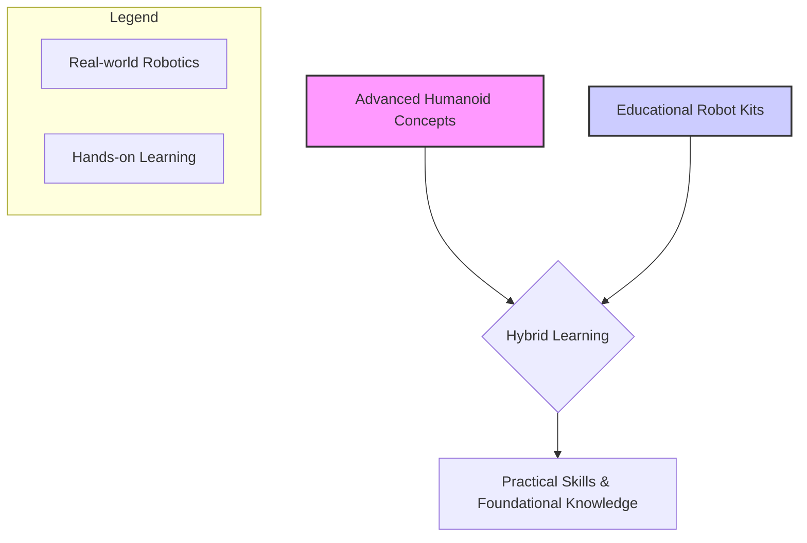

# Chapter 1: Introduction to Physical AI & Humanoid Robotics

Welcome to "Physical AI & Humanoid Robotics: A Hybrid Approach"! This book embarks on an exciting journey into the convergence of artificial intelligence and physical robotics, with a special focus on humanoid forms. As technology advances, robots are no longer confined to industrial assembly lines; they are stepping into our homes, hospitals, and even classrooms, becoming more interactive and intelligent.

## Overview of Physical AI

Physical AI is a branch of artificial intelligence that focuses on intelligent systems embodied in physical forms, allowing them to interact with and learn from the real world. Unlike purely software-based AI, Physical AI agents perceive, act, and influence their environment through sensors and actuators. This embodiment introduces unique challenges and opportunities, as the AI must contend with the complexities of physics, real-time constraints, and unexpected physical interactions.

Key aspects of Physical AI include:
-   **Embodiment**: The AI exists within a physical body, enabling direct interaction with its surroundings.
-   **Perception**: Utilizing sensors (cameras, touch, lidar, IMUs) to gather data from the physical world.
-   **Actuation**: Executing actions through motors, servos, and other mechanical components to manipulate the environment or move.
-   **Learning in the Physical World**: Adapting and improving behaviors based on real-world experiences, often involving techniques like reinforcement learning.

## What are Humanoid Robots?

Humanoid robots are a fascinating subset of physical AI, designed to resemble the human body in form and often in function. Their bipedal locomotion, two arms, and head-like structures allow them to operate in environments built for humans. This design choice is not merely aesthetic; it enables humanoids to use human tools, navigate human spaces, and interact with people in a more intuitive and socially acceptable manner.

Examples of prominent humanoid robots include:
-   **Boston Dynamics Atlas**: Renowned for its advanced mobility, balance, and dynamic movements.
-   **Tesla Optimus**: An ambitious project aiming for mass-produced, general-purpose humanoid robots.
-   **NAO Robot**: A smaller, programmable humanoid robot widely used in research and education for human-robot interaction studies.
-   **Astroboy (fictional inspiration)**: While fictional, it embodies the long-held dream of intelligent, human-like robots.

## Hybrid Learning vs. Real-World Robotics

This book adopts a unique **hybrid learning approach**. We recognize that access to advanced, expensive humanoid robots like Atlas or Optimus is limited. Therefore, we bridge the gap between theoretical knowledge and practical application by combining:

1.  **Real-world Robotics Concepts**: Delving into the sophisticated principles behind advanced humanoids, including their anatomy, control systems, and AI algorithms.
2.  **Educational Learning Kits**: Providing practical, hands-on examples and experiments using accessible and affordable educational robot kits (e.g., NAO, Astro, or even simpler platforms like Raspberry Pi-powered robotic arms). This allows you to apply core Physical AI and robotics concepts without needing high-end hardware.

This hybrid model offers several advantages:
-   **Accessibility**: Makes learning about complex humanoid robotics available to a wider audience.
-   **Hands-on Experience**: Enables practical implementation and experimentation with real hardware.
-   **Conceptual Understanding**: Grounds theoretical knowledge with tangible, interactive examples.
-   **Cost-Effectiveness**: Reduces the barrier to entry for robotics education.



| Feature | Advanced Humanoid (e.g., Atlas) | Educational Kit (e.g., NAO) |
| :--- | :--- | :--- |
| **Cost** | Very High (Millions USD) | Moderate (Thousands USD) |
| **Complexity** | Extremely High | High |
| **Accessibility**| Restricted (Research Labs) | Widely available for education |
| **Main Use** | Research, Industrial Automation | Education, Human-Robot Interaction |

Throughout the book, we will explore how concepts from advanced humanoids can be simplified and applied to educational platforms, providing you with a robust understanding and practical skills in Physical AI and humanoid robotics.

## Hybrid Example: Understanding Movement (Conceptual)

To illustrate the hybrid learning approach, let's consider a fundamental task: making a robot move forward. The underlying complexity varies greatly between a sophisticated humanoid and a simpler educational kit, yet the core concept remains the same.

### Scenario 1: Advanced Humanoid Robot (e.g., Atlas/Optimus - Conceptual)

For a complex bipedal humanoid, a simple "move forward" command involves intricate calculations to maintain balance, coordinate multiple joints, and execute precise foot placements. The AI needs to manage dynamic stability, adjust for terrain, and ensure smooth gait.

```python
# Pseudo-code for an advanced humanoid robot
class HumanoidRobot:
    def __init__(self):
        self.kinematics_engine = KINEMATICS_ENGINE()
        self.balance_controller = BALANCE_CONTROLLER()
        self.joint_actuators = JOINT_ACTUATORS()

    def move_forward(self, distance_meters: float, speed_mps: float):
        print(f"Humanoid: Calculating gait for {distance_meters}m at {speed_mps} m/s...")
        # Complex planning for foot trajectory, joint angles, and center of mass shifts
        gait_plan = self.kinematics_engine.plan_gait(distance_meters, speed_mps)

        for step in gait_plan:
            self.joint_actuators.set_joint_angles(step.joint_config)
            self.balance_controller.adjust_balance(self.joint_actuators.get_current_pose())
            # ... execute step with real-time feedback
            print("Humanoid: Executing step...")

# Usage:
atlas = HumanoidRobot()
atlas.move_forward(distance_meters=1.0, speed_mps=0.2)
```

### Scenario 2: Educational Robot Kit (e.g., Wheeled Robot with Raspberry Pi/Arduino)

For a simpler educational kit, like a wheeled robot, the "move forward" command is much more direct. It typically involves setting motor speeds and managing basic timing. While less complex, it still teaches fundamental control concepts like open-loop control.

```python
# More detailed pseudo-code for an educational wheeled robot kit
import time

# --- Mock Hardware Interface ---
# In a real scenario, this would be a library like RPi.GPIO or similar
class MockMotor:
    def __init__(self, port):
        self._port = port
        self._speed = 0
        print(f"Initialized mock motor on port {self._port}")

    def set_speed(self, speed_percent):
        # Speed is a value from -100 to 100
        self._speed = max(-100, min(100, speed_percent))
        if self._speed == 0:
            print(f"Motor {self._port}: STOPPED")
        else:
            direction = "FORWARD" if self._speed > 0 else "BACKWARD"
            print(f"Motor {self._port}: set to {abs(self._speed)}% speed {direction}")

    def stop(self):
        self.set_speed(0)

class EducationalRobotKit:
    def __init__(self):
        # Initialize motors connected to a mock driver board
        self.left_motor = MockMotor(port='LEFT')
        self.right_motor = MockMotor(port='RIGHT')

    def move_forward(self, duration_seconds: float, speed_percent: int):
        """Moves the robot forward by running both motors at the same speed."""
        print(f"\nEducational Kit: Moving forward at {speed_percent}% for {duration_seconds}s...")
        self.left_motor.set_speed(speed_percent)
        self.right_motor.set_speed(speed_percent)
        time.sleep(duration_seconds)
        self.stop()

    def turn_right(self, duration_seconds: float, speed_percent: int):
        """Turns the robot right by running motors in opposite directions."""
        print(f"\nEducational Kit: Turning right at {speed_percent}% for {duration_seconds}s...")
        self.left_motor.set_speed(speed_percent)
        self.right_motor.set_speed(-speed_percent) # Negative speed for reverse
        time.sleep(duration_seconds)
        self.stop()

    def stop(self):
        """Stops all robot movement."""
        print("\nEducational Kit: Halting all motors.")
        self.left_motor.stop()
        self.right_motor.stop()

# --- Main Program Execution ---
if __name__ == "__main__":
    # Create an instance of our robot
    my_robot = EducationalRobotKit()

    # Execute a simple sequence of movements
    my_robot.move_forward(duration_seconds=2.0, speed_percent=70)
    my_robot.turn_right(duration_seconds=1.5, speed_percent=50)
    my_robot.move_forward(duration_seconds=1.0, speed_percent=60)

    print("\nEducational Kit: Movement sequence complete.")
```

This conceptual example highlights how the same high-level goal ("move forward") is achieved through vastly different levels of underlying complexity and control. Our hybrid approach allows you to grasp the advanced concepts (Scenario 1) while gaining hands-on experience with more accessible platforms (Scenario 2).

---