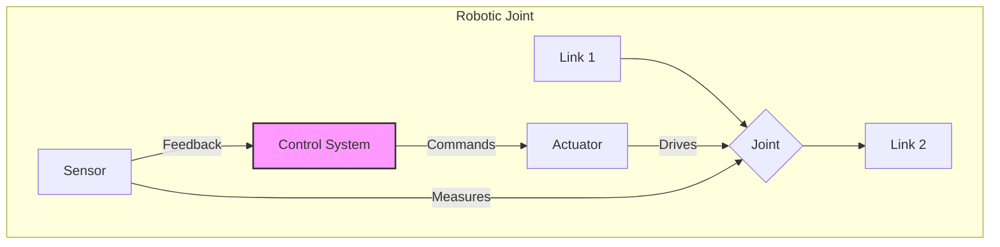

# Chapter 8: Robot Anatomy and Actuation


This chapter delves into the fundamental components that give robots their physical form and movement capabilities. Understanding robot anatomy and actuation is crucial for designing, building, and controlling any robotic system.

## Skeleton and Frame Structure

The skeleton or frame is the foundational structure of a robot, providing rigidity and defining its overall shape. Much like the human skeleton, it supports all other components and dictates the robot's range of motion.

### Key Aspects:
-   **Materials:** Common materials include aluminum, steel, carbon fiber, and various plastics. The choice depends on factors like strength-to-weight ratio, cost, and specific application requirements.
-   **Rigidity:** A rigid frame minimizes unwanted vibrations and deflections, ensuring precise movements.
-   **Modular Design:** Many robot frames are designed with modularity in mind, allowing for easy assembly, disassembly, and customization of components.
-   **Kinematic Chains:** The frame dictates the arrangement of links and joints, forming kinematic chains that enable complex movements.

## Joints

Joints are the connection points between the rigid links of a robot's skeleton, allowing relative motion between them. They are essential for a robot's articulation and flexibility.



### Types of Joints:
-   **Revolute (Rotary) Joint:** Allows rotational motion around a single axis (e.g., a hinge). This is the most common type of joint in robotic arms.
-   **Prismatic (Linear) Joint:** Allows linear motion along a single axis (e.g., a sliding mechanism).
-   **Spherical (Ball-and-Socket) Joint:** Allows rotational motion in multiple directions (e.g., a shoulder joint). Less common in industrial robots due to complexity but present in humanoids.
-   **Cylindrical Joint:** Combines revolute and prismatic motion along the same axis.
-   **Planar Joint:** Allows translation in two directions and rotation around an axis perpendicular to the plane.

## Actuators

Actuators are the "muscles" of a robot, responsible for generating motion. They convert energy (electrical, pneumatic, hydraulic) into mechanical force or torque.

| Actuator Type | Power Source | Key Characteristics |
| :--- | :--- | :--- |
| **Electric Motors** | Electricity | Precise, controllable, clean |
| **Hydraulic Actuators** | Pressurized Fluid | High power, high force |
| **Pneumatic Actuators**| Compressed Air | Fast, lightweight, clean |
| **Smart Materials** | Electricity/Heat | Silent, compact, novel |

### Common Types of Actuators:
-   **Electric Motors:**
    -   **DC Motors:** Simple, inexpensive, and widely used for continuous rotation.
    -   **Stepper Motors:** Provide precise angular positioning without feedback, often used in open-loop control.
    -   **Servo Motors:** Combine a DC motor with a gearbox and an encoder for precise position, velocity, and torque control. They are prevalent in robotics due to their high precision and responsiveness.
-   **Hydraulic Actuators:** Use pressurized fluid to generate large forces and torques. Common in heavy-duty industrial robots.
-   **Pneumatic Actuators:** Use compressed air to generate linear or rotational motion. Known for their speed and cleanliness, often used for gripping or simple pick-and-place tasks.
-   **Shape Memory Alloys (SMAs) and Smart Materials:** Emerging actuators that change shape or stiffness in response to electrical current or temperature, offering compact and silent operation.

## Motors and Servos Explained

While often used interchangeably in general conversation, motors and servos have distinct characteristics in robotics.

### Motors:
-   Generally refers to electric motors (DC, AC, stepper) that convert electrical energy into mechanical energy (rotation or linear motion).
-   Often require external control circuitry (motor drivers, speed controllers) and feedback mechanisms (encoders) for precise control.
-   Used where continuous rotation, high speed, or high torque are primary requirements.

### Servos (Servo Motors):
-   Are a complete package consisting of a DC motor, a gearbox, a position feedback sensor (potentiometer or encoder), and an integrated control circuit.
-   They are designed for precise position control, where the desired angle or position is commanded, and the servo actively works to maintain that position.
-   Widely used in robotic arms, remote-controlled vehicles, and other applications requiring accurate angular positioning.
-   Typically communicate using Pulse Width Modulation (PWM) signals.

In summary, the sophisticated interplay of a robust skeleton, various types of joints, and powerful actuators (especially motors and servos) enables robots to perform a wide array of tasks, from delicate manipulation to heavy lifting.

## Code Example: Controlling a Servo

The following pseudo-code shows how a servo motor is typically controlled. The angle you want is converted into a specific electrical pulse (Pulse Width Modulation), which the servo's internal circuit understands.

```python
# Simple pseudo-code for controlling a servo motor with PWM

# In a real-world scenario, you would use a library like RPi.GPIO on a Raspberry Pi
# or the Arduino Servo library.

class ServoController:
    def __init__(self, pwm_pin, min_pulse=500, max_pulse=2500):
        self.pwm_pin = pwm_pin
        self.min_pulse = min_pulse # Pulse width in microseconds for 0 degrees
        self.max_pulse = max_pulse # Pulse width in microseconds for 180 degrees
        print(f"Initialized Servo on PWM pin {self.pwm_pin}")

    def set_angle(self, angle):
        """Converts an angle (0-180) to a PWM pulse width and sends it."""
        if not 0 <= angle <= 180:
            print("Error: Angle must be between 0 and 180 degrees.")
            return
        
        # Map the angle (0-180) to the pulse width range (e.g., 500-2500 us)
        pulse_width = self.min_pulse + (self.max_pulse - self.min_pulse) * (angle / 180.0)
        
        print(f"Setting angle to {angle}° by sending a pulse of {pulse_width:.0f} microseconds.")
        # In a real system, this would configure the hardware PWM output
        # self.pwm_pin.send_pulse(pulse_width)

# --- Main Program ---
if __name__ == "__main__":
    # Create a servo controller instance on a mock PWM pin 12
    wrist_servo = ServoController(pwm_pin=12)

    print("\nMoving servo to initial position (90 degrees)...")
    wrist_servo.set_angle(90)

    import time
    time.sleep(1)

    print("\nSweeping the servo from 0 to 180 degrees...")
    for angle in range(0, 181, 10):
        wrist_servo.set_angle(angle)
        time.sleep(0.2)
    
    print("\nSweep complete.")
```
---
