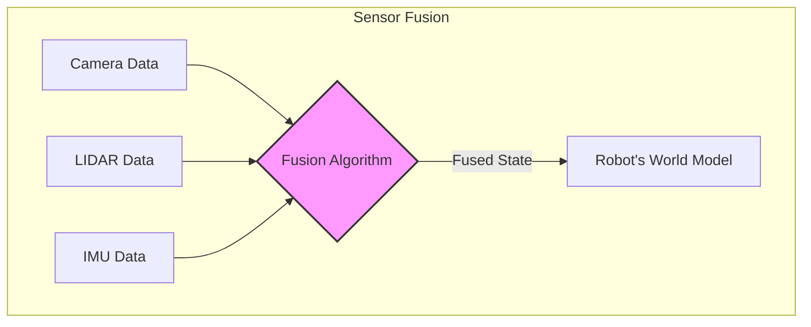

# Chapter 9: Sensors and Perception Systems


Robots interact with and understand their environment through a variety of sensors, forming the backbone of their perception systems. These systems allow robots to gather data, interpret it, and use that information to navigate, manipulate objects, and perform complex tasks. This chapter explores common sensors used in robotics and the crucial concept of sensor fusion.

## Cameras

Cameras are one of the most fundamental sensors for robots, providing visual information about the environment.

-   **How they work:** Cameras capture light and convert it into digital images or video streams. Different types of cameras exist, including monocular (single camera), stereo (two cameras for depth perception), and RGB-D cameras (providing color and depth information).
-   **Applications:**
    -   **Object recognition and tracking:** Identifying and following specific objects.
    -   **Navigation and mapping:** Visual odometry, SLAM (Simultaneous Localization and Mapping).
    -   **Human-robot interaction:** Recognizing gestures, facial expressions.
    -   **Quality control and inspection:** Detecting defects in manufacturing.

## LIDAR (Light Detection and Ranging)

LIDAR systems use pulsed laser light to measure distances to the surrounding environment, creating detailed 3D maps.

-   **How it works:** A LIDAR unit emits laser pulses and measures the time it takes for each pulse to return after reflecting off an object. This "time-of-flight" data is used to calculate the distance. By rotating the laser and sensor, a point cloud representing the environment is generated.
-   **Applications:**
    -   **High-precision mapping:** Creating accurate 3D maps for autonomous navigation.
    -   **Obstacle detection and avoidance:** Identifying obstacles in real-time for safe movement.
    -   **Localization:** Determining the robot's position within a known map.
    -   **Environmental understanding:** Analyzing terrain, building layouts.

## IMU (Inertial Measurement Unit)

An IMU is an electronic device that measures and reports a body's specific force, angular rate, and sometimes the orientation of the body, using a combination of accelerometers, gyroscopes, and magnetometers.

-   **How it works:**
    -   **Accelerometers:** Measure linear acceleration.
    -   **Gyroscopes:** Measure angular velocity (rate of rotation).
    -   **Magnetometers:** Measure magnetic field strength, providing a compass heading.
-   **Applications:**
    -   **Orientation and pose estimation:** Determining the robot's tilt, roll, and yaw.
    -   **Dead reckoning:** Estimating position and velocity based on initial position and subsequent measurements.
    -   **Stabilization:** Maintaining balance in flying or walking robots.
    -   **Motion tracking:** Recording and analyzing movements.

## Touch Sensors

Touch sensors, also known as tactile sensors, provide robots with a sense of physical contact, pressure, and force.

-   **How they work:** These sensors can vary widely, from simple contact switches to more sophisticated arrays that measure pressure distribution. They detect physical interaction with objects or the environment.
-   **Applications:**
    -   **Grasping and manipulation:** Detecting contact with objects to apply appropriate force without crushing them.
    -   **Collision detection:** Sensing unexpected contact with the environment to prevent damage.
    -   **Haptic feedback:** Providing a sense of touch to human operators in teleoperation.
    -   **Surface texture analysis:** Distinguishing between different material properties.

| Sensor | Measures | Strengths | Weaknesses |
| :--- | :--- | :--- | :--- |
| **Camera** | Light, Color | High-resolution, rich detail | Poor in low light, no depth (mono) |
| **LIDAR** | Distance (via laser) | Accurate 3D mapping, works in dark | Can be expensive, struggles with reflective surfaces |
| **IMU** | Inertia, Rotation | Tracks orientation/motion | Prone to drift over time |
| **Touch Sensor**| Force, Pressure | Direct physical feedback | Requires contact, limited range |

## Sensor Fusion

Each sensor provides a limited and often noisy view of the world. Sensor fusion is the process of combining data from multiple sensors to achieve a more accurate, reliable, and comprehensive understanding of the environment and the robot's state than would be possible using individual sensors alone.



-   **Why it's necessary:**
    -   **Redundancy:** If one sensor fails, others can still provide data.
    -   **Complementarity:** Different sensors provide different types of information (e.g., cameras provide color, LIDAR provides precise depth).
    -   **Noise reduction:** Combining noisy data from multiple sources can lead to a cleaner, more accurate estimate.
    -   **Improved robustness:** A system relying on multiple sensors is less susceptible to individual sensor limitations or failures.

-   **Techniques:** Common sensor fusion techniques include Kalman filters, Extended Kalman Filters (EKF), Unscented Kalman Filters (UKF), and particle filters, which statistically combine sensor readings over time to estimate the robot's state (position, velocity, orientation) and environmental features.

-   **Example for Movement and Perception:**
    -   An autonomous vehicle might fuse data from cameras (for lane detection, traffic light recognition), LIDAR (for precise obstacle distances and 3D mapping), radar (for velocity of other vehicles), and IMU (for its own orientation and movement) to form a robust model of its surroundings and its own dynamic state. This combined perception allows for safe and efficient navigation.

By integrating and interpreting data from diverse sensors, robots can build a rich and accurate perception of their world, enabling them to operate effectively in complex and dynamic environments.

## Code Example: Sensor Fusion Concept

The following pseudo-code illustrates a highly simplified version of sensor fusion, conceptually similar to a Kalman filter. The robot uses its own motion prediction and a noisy external sensor (like a GPS) to arrive at a more accurate position estimate than either source could provide alone.

```python
# Simple pseudo-code for sensor fusion (Kalman Filter concept)

import random

class SimpleRobotState:
    def __init__(self):
        # The robot's "belief" about its position
        self.position_estimate = 0.0
        self.velocity_estimate = 0.0
        
        # How uncertain the robot is about its estimates
        self.position_uncertainty = 1.0
        self.velocity_uncertainty = 1.0

    def predict(self, dt=0.1):
        """Predicts the next state based on current velocity (no new sensor data)."""
        # Position_new = Position_old + Velocity * dt
        self.position_estimate += self.velocity_estimate * dt
        # Uncertainty grows over time without new data
        self.position_uncertainty += 0.1
        print(f"Predict Step: New estimated position = {self.position_estimate:.2f}")

    def update(self, gps_measurement):
        """Updates the state belief using a new sensor measurement."""
        # --- Simplified Kalman Filter Steps ---
        
        # 1. Compare the measurement to the estimate
        measurement_error = gps_measurement - self.position_estimate
        
        # 2. Calculate Kalman Gain (how much to trust the new measurement)
        # This is highly simplified. A real Kalman Gain involves sensor noise.
        kalman_gain = self.position_uncertainty / (self.position_uncertainty + 0.5) # Assuming GPS noise is 0.5
        
        # 3. Update the estimate
        self.position_estimate += kalman_gain * measurement_error
        
        # 4. Reduce uncertainty because we have new data
        self.position_uncertainty = (1 - kalman_gain) * self.position_uncertainty
        
        print(f"Update Step: GPS measured {gps_measurement:.2f}. Corrected position to {self.position_estimate:.2f}")
        print(f"  -> New uncertainty: {self.position_uncertainty:.2f}\n")

# --- Main Program ---
if __name__ == "__main__":
    robot = SimpleRobotState()
    
    # Simulate the robot moving and getting GPS readings
    for i in range(5):
        print(f"--- Cycle {i+1} ---")
        # Robot's internal model predicts where it should be
        robot.predict()
        
        # Robot gets a new (noisy) GPS reading
        true_position = i * 0.5 # The robot is actually moving at 0.5 m/s
        gps_noise = random.uniform(-0.3, 0.3)
        gps_reading = true_position + gps_noise
        
        # Robot fuses the GPS reading with its prediction
        robot.update(gps_reading)

```
---
