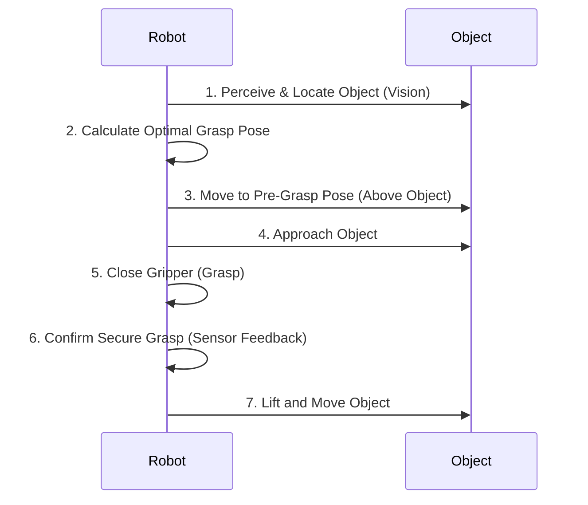

# Chapter 10: Manipulation & Grasping

## Introduction

For a humanoid robot to be useful, it must be able to interact physically with its environment. **Manipulation** is the general term for this interaction, while **grasping**—the act of picking up and holding objects—is one of its most fundamental and challenging aspects. This chapter explores the hardware, techniques, and sensing involved in enabling robots to manipulate the world around them.

## Anatomy of Hands and Grippers

A robot's ability to manipulate objects is largely defined by its **end-effector**, the device at the end of the robotic arm. For grasping, this is typically a hand or a gripper.

-   **Anthropomorphic Hands:** These are designed to mimic the human hand, with multiple fingers and high degrees of freedom (DOF). They are incredibly versatile but also mechanically complex and difficult to control.
-   **Multi-Fingered Grippers:** A simpler version of the above, often with two or three fingers. They offer a good balance of flexibility and control for a wide range of tasks.
-   **Underactuated Grippers:** These use fewer motors than joints, relying on mechanical linkages to make the fingers conform to the shape of an object. This design simplifies control while still allowing for a secure grasp on irregular items.
-   **Parallel Jaw Grippers:** The most common type in industrial robotics, with two parallel fingers that move to pinch an object. They are simple, robust, and effective for known object shapes.
-   **Vacuum Grippers:** Use suction to lift and hold objects, ideal for flat, non-porous surfaces like glass or sheet metal.

## Grasping Techniques

Once a robot has a hand, it must decide *how* to grasp an object. The strategy depends on the object's shape, weight, and the task to be performed.

| Grasp Type | Description | Use Case |
| :--- | :--- | :--- |
| **Power Grasp** | Wrapping all fingers around an object to maximize contact area. | Lifting heavy objects, holding tools like a hammer. |
| **Precision Grasp**| Using fingertips to hold an object, allowing for fine control. | Picking up small, delicate items like a screw or a key. |
| **Pinch Grasp** | Using the thumb and one finger, often the index finger. | Holding a pen, picking up a coin. |
| **Hook Grasp** | Using curled fingers as a hook, with the thumb often being passive. | Carrying a bag with handles or a bucket. |

Determining the optimal grasp points on an object is a complex problem in robotics, often solved using computer vision and simulation to analyze the object's geometry and predict a stable grasp.

## The Grasping Sequence

A typical robotic grasp follows a sequence of steps, often calculated by a motion planner.



## Sensors for Manipulation

To grasp objects reliably, especially in unstructured environments, robots rely heavily on sensor feedback.

-   **Force/Torque Sensors:** Placed in the wrist or fingers, these sensors measure the forces and torques being applied. This feedback is crucial for applying just enough force to hold an object securely without crushing it.
-   **Tactile Sensors:** These act like the skin on human fingers, providing detailed information about pressure distribution, texture, and shape. They help the robot detect if an object is slipping and adjust its grip accordingly.
-   **Vision Sensors (Cameras):** Cameras (often in the head or wrist) are used to locate the object and guide the hand towards it. Depth cameras (like stereo or RGB-D) are particularly useful for determining the object's 3D shape.

## Hybrid Examples

### Example 1: Simulating Grasping with PyBullet (Conceptual)

PyBullet is a physics simulation library that is excellent for prototyping and testing robotics algorithms, including grasping, before running them on a physical robot.

```python
# Detailed pseudo-code for a grasping simulation in PyBullet

import pybullet as p
import pybullet_data
import time

def setup_simulation():
    """Sets up the PyBullet simulation environment."""
    physicsClient = p.connect(p.GUI)
    p.setAdditionalSearchPath(pybullet_data.getDataPath())
    p.setGravity(0, 0, -9.81)
    p.loadURDF("plane.urdf")
    return physicsClient

def load_assets():
    """Loads the robot and the object to be grasped."""
    # Load a simple robotic arm (e.g., KUKA LBR iiwa)
    robot_start_pos = [0, 0, 0]
    robot_start_orientation = p.getQuaternionFromEuler([0, 0, 0])
    robot_id = p.loadURDF("kuka_iiwa/model.urdf", robot_start_pos, robot_start_orientation, useFixedBase=True)

    # Load an object to grasp
    object_start_pos = [0.7, 0, 0.1]
    object_id = p.loadURDF("cube.urdf", object_start_pos)
    
    return robot_id, object_id

def perform_grasp(robot_id, object_id):
    """Simulates a simple grasping sequence."""
    end_effector_link_index = 6
    
    # Define key poses
    pre_grasp_pos = [0.7, 0, 0.4]
    pre_grasp_orient = p.getQuaternionFromEuler([0, -3.14, 0])
    grasp_pos = [0.7, 0, 0.15]
    post_grasp_pos = [0.7, 0, 0.5]

    print("Moving to pre-grasp pose...")
    joint_poses = p.calculateInverseKinematics(robot_id, end_effector_link_index, pre_grasp_pos, pre_grasp_orient)
    p.setJointMotorControlArray(robot_id, range(7), p.POSITION_CONTROL, targetPositions=joint_poses)
    for _ in range(100):
        p.stepSimulation()
        time.sleep(1./240.)

    print("Moving to grasp pose and closing gripper...")
    joint_poses = p.calculateInverseKinematics(robot_id, end_effector_link_index, grasp_pos, pre_grasp_orient)
    p.setJointMotorControlArray(robot_id, range(7), p.POSITION_CONTROL, targetPositions=joint_poses)
    for _ in range(50):
        p.stepSimulation()
        time.sleep(1./240.)
        
    constraint_id = p.createConstraint(robot_id, end_effector_link_index, object_id, -1, 
                                     p.JOINT_FIXED, [0, 0, 0], [0, 0, 0], [0, 0, 0])
    print("Object grasped!")
    
    print("Lifting the object...")
    joint_poses = p.calculateInverseKinematics(robot_id, end_effector_link_index, post_grasp_pos, pre_grasp_orient)
    p.setJointMotorControlArray(robot_id, range(7), p.POSITION_CONTROL, targetPositions=joint_poses)
    for _ in range(150):
        p.stepSimulation()
        time.sleep(1./240.)
        
    p.removeConstraint(constraint_id)

if __name__ == "__main__":
    client = setup_simulation()
    robot, cube = load_assets()
    perform_grasp(robot, cube)
    print("\nSimulation finished.")
    time.sleep(5)
    p.disconnect()
```

### Example 2: Using an Educational Robotic Arm (Hands-on)

With an educational robotic arm kit (like those from uFactory or Trossen Robotics), you can translate the simulation into reality.
1.  **Setup:** Connect the arm to a controller (like a Raspberry Pi or Arduino).
2.  **Vision:** Use a webcam to capture an image of the workspace. Use a library like OpenCV to find the coordinates of the object you want to grasp.
3.  **Planning:** Convert the object's pixel coordinates into real-world coordinates. Use inverse kinematics to calculate the joint angles needed for the arm to reach the object.
4.  **Execution:** Send commands to the arm's servo motors to move it through the pre-grasp, grasp, and lift poses, similar to the simulation sequence. The final step involves sending a command to close the gripper.

## Conclusion

Manipulation and grasping are what allow a robot to be more than just a passive observer. By combining sophisticated hands, smart grasping strategies, and rich sensor feedback, robots can perform a vast and growing range of useful physical tasks.

---
