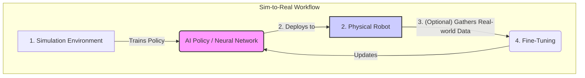

# Chapter 12: Learning in Physical AI

## Introduction

This chapter explores the critical role of learning in Physical AI, emphasizing how humanoid robots acquire skills and adapt to complex, real-world environments. While classical control systems are excellent for predefined tasks, learning-based approaches allow robots to develop new, complex behaviors autonomously. We will delve into two key paradigms: Reinforcement Learning (RL) and Learning from Demonstration (LfD).

## Reinforcement Learning (RL)

Reinforcement Learning is a powerful machine learning paradigm where a robot, or "agent," learns to make optimal decisions through trial and error.

### Core Concepts of RL

*   **Agent:** The robot, which acts as the decision-maker.
*   **Environment:** The physical world (or a simulation of it) where the agent operates.
*   **State:** A snapshot of the environment at a particular moment (e.g., the robot's joint angles, velocity, and camera data).
*   **Action:** A command the agent can execute (e.g., applying a specific torque to a motor).
*   **Reward:** A numerical feedback signal from the environment. The agent's goal is to choose actions that maximize its total cumulative reward over time.
*   **Policy:** The "brain" of the agent. It is a strategy, often represented by a neural network, that maps a given state to a specific action. The goal of RL is to find the optimal policy.

### RL for Humanoid Robots

RL is particularly effective for tasks that are difficult to program by hand.
*   **Locomotion:** RL can train a robot to walk, run, or even perform acrobatic maneuvers. The reward function can be designed to encourage forward movement, maintain balance, and minimize energy consumption, while penalizing falls.
*   **Manipulation:** By rewarding successful grasps, an RL agent can learn how to pick up objects of various shapes and sizes, a task that is notoriously difficult to program with explicit rules.
*   **Whole-Body Control:** For complex actions like standing up from a fall or pushing a heavy object, RL can learn to coordinate all of the robot's joints in a holistic and dynamic way.

## Learning From Demonstration (LfD)

Learning from Demonstration, or imitation learning, offers a more direct way to teach a robot new skills. Instead of learning through trial and error, the robot learns by observing examples provided by a human teacher.

### Core Concepts of LfD

*   **Demonstrations:** A human performs the desired task, and the robot records the states and actions. This can be done through various methods, including physically guiding the robot's limbs (kinesthetic teaching) or having the robot watch via its cameras.
*   **Policy Learning:** The robot uses this dataset of demonstrations to learn a policy that can replicate the observed behavior in similar situations.

### LfD Applications

*   **Complex Manipulation:** LfD is excellent for teaching tasks that require fine motor skills, such as learning to write, pour a liquid, or assemble a product.
*   **Social Interactions:** A robot can learn appropriate gestures and movements for human-robot interaction by observing people.

## Comparison of Learning Techniques

| Learning Technique | How it Works | Pros | Cons |
| :--- | :--- | :--- | :--- |
| **Reinforcement Learning (RL)** | Trial and error with rewards/penalties. | Can discover novel, optimal solutions that surpass human performance. | Very data-hungry (can take millions of trials), and exploration can be unsafe for a physical robot. |
| **Learning from Demonstration (LfD)** | Mimics human-provided examples. | Much faster and safer way to teach a specific skill. More intuitive for the human teacher. | The robot's performance is limited by the quality of the demonstrations; it struggles to generalize to new situations. |
| **Sim-to-Real Transfer** | Train an RL agent in a fast, safe simulation, then transfer the learned policy to the real robot. | Allows for massive data collection without risk to physical hardware. | The "reality gap"—differences between simulation and reality—can make the transferred policy fail. |

## Hybrid Examples

### Sim-to-Real Transfer for Walking

The "reality gap" is a major hurdle in modern robotics. A policy trained perfectly in a simulator may fail on a real robot due to subtle differences in friction, motor response, or sensor noise. A common workflow to overcome this is:

1.  **Train in Simulation:** An RL agent is trained for millions of steps in a physically realistic simulator (like PyBullet or Isaac Gym). The simulation environment often includes randomization of physics parameters (e.g., mass, friction) to force the policy to be more robust.
2.  **Deploy on Real Robot:** The trained policy (the "brain") is loaded onto the physical robot.
3.  **Fine-Tune (Optional):** The robot may perform additional, limited learning in the real world to adapt to the specific nuances of its own hardware and environment.



### Code Example: Conceptual Sim-to-Real

The following pseudo-code outlines the logic of a sim-to-real training process.

```python
# Conceptual pseudo-code for a Sim-to-Real workflow

class SimulationManager:
    def __init__(self):
        print("Initializing simulation environment (e.g., PyBullet, Isaac Gym)...")
        self.sim_robot = "Simulated_Robot_Model"
    
    def run_training_episode(self, policy_network):
        """Runs one episode of RL training in the simulation."""
        print("  [SIM] Running new episode...")
        total_reward = 0
        
        for step in range(100): # Simulate for 100 steps
            sim_state = "get_sim_robot_state()"
            action = policy_network.get_action(sim_state)
            sim_reward = "apply_action_and_get_reward(action)"
            total_reward += sim_reward
            policy_network.update(sim_state, action, sim_reward)
            
            if "sim_robot_has_fallen()":
                print("  [SIM] Robot fell! Episode over.")
                break
        print(f"  [SIM] Episode finished with reward: {total_reward}")

class RealWorldRobot:
    def __init__(self):
        print("Initializing connection to physical robot hardware...")
        self.physical_robot = "Physical_Robot_Interface"
        
    def deploy_policy(self, trained_policy):
        """Deploys the trained policy to the real robot for a test."""
        print("\n  [REAL] Deploying trained policy to physical robot...")
        for step in range(50):
            real_state = "get_real_robot_state_from_sensors()"
            action = trained_policy.get_action(real_state)
            "apply_action_to_real_motors(action)"
            print(f"  [REAL] Step {step+1}: Executing learned action...")
            if "real_robot_imu_detects_fall()":
                print("  [REAL] Physical robot is unstable! Halting.")
                break
        print("  [REAL] Deployment test finished.")


if __name__ == "__main__":
    ai_policy = "PolicyNetwork()" # A neural network
    
    print("\n--- Phase 1: Training in Simulation ---")
    sim_manager = SimulationManager()
    for i in range(5): # Train for 5 episodes for this example
        sim_manager.run_training_episode(ai_policy)
        
    print("\n--- Phase 2: Deploying to the Real World (Sim2Real) ---")
    real_robot = RealWorldRobot()
    real_robot.deploy_policy(ai_policy)
```

## Conclusion

Learning is what elevates a robot from a mere machine to an intelligent agent. By combining the strengths of Reinforcement Learning's ability to discover optimal behaviors with the directness of Learning from Demonstration, and leveraging simulation to make data collection safe and efficient, researchers are creating humanoid robots that are more capable, robust, and adaptable than ever before.
---
