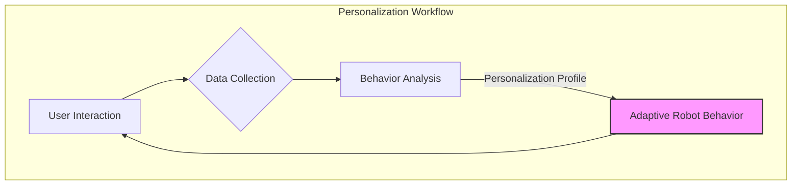

# Chapter 19: User Personalization & Multi-Language Support

## Introduction

As humanoid robots become more integrated into daily life, their ability to adapt to individual users and diverse linguistic backgrounds is crucial. This chapter explores the concepts of user personalization and multi-language support (localization) in Physical AI, enhancing the robot's effectiveness and user acceptance.

## User Personalization Strategies

Personalization transforms a generic robot into an intelligent assistant tailored to individual preferences, habits, and needs. This involves the robot learning about its user over time and adjusting its behavior accordingly.

### Key Aspects of Personalization:

1.  **Preference Learning:**
    -   **Explicit:** Users directly state their preferences (e.g., "Always greet me with a cheerful voice," "I prefer coffee at 8 AM").
    -   **Implicit:** The robot observes user behavior patterns (e.g., noting frequently visited locations, preferred interaction times, common requests).
2.  **Adaptive Interaction Styles:**
    -   Adjusting speech tone, volume, and pace based on user's emotional state or hearing ability.
    -   Modifying gesture intensity or physical proximity based on cultural norms or user comfort levels.
3.  **Customizable Learning Paths (Educational Robots):**
    -   For educational humanoids, personalization means adapting teaching methods, content difficulty, and feedback style to the student's learning pace and knowledge gaps.
    -   This can involve tracking student progress, identifying areas of struggle, and offering tailored exercises.
4.  **Memory and Context:**
    -   Recalling past conversations, previous tasks, or important user-specific information to maintain continuity and provide contextually relevant responses.



## Multi-Language Support (Localization)

For robots deployed in a globalized world, communicating in multiple languages is not just a convenience, but a necessity. **Localization** adapts a robot's communication and cultural nuances to specific regions or languages.

### Challenges in Multi-Language Support:

1.  **Speech Recognition Accuracy:** ASR models must be robust for various accents, dialects, and speaking rates in each supported language.
2.  **Natural Language Understanding (NLU):** Translating words is one thing; understanding context, idioms, and cultural references in different languages is far more complex.
3.  **Speech Synthesis Quality:** Ensuring synthesized speech sounds natural and expressive in every language.
4.  **Text Rendering:** Correctly displaying text, including right-to-left languages (e.g., Arabic, Hebrew) or character-based languages.
5.  **Cultural Nuances:** Beyond language, robots might need to adapt their gestures, greetings, and interaction protocols to fit local customs.

## Localization Strategies

| Strategy | Description | Pros | Cons |
| :--- | :--- | :--- | :--- |
| **Direct Translation** | Translate all robot phrases and UI text directly. | Simplest to implement for basic phrases. | Can sound unnatural; misses cultural context. |
| **Transcreation** | Adapt content and tone to resonate culturally, not just linguistically. | Highly natural and culturally appropriate. | More complex, requires deep linguistic and cultural understanding. |
| **Dynamic Language Switching** | Robot detects user's language and switches automatically. | Highly user-friendly, seamless experience. | Requires robust real-time language detection. |
| **Personalized Language** | User sets preferred language in their profile. | User has full control. | Less adaptive in multi-user scenarios. |

## Code Example: Simple Multi-Language Greeting Script (Python)

This Python script demonstrates a basic approach to multi-language support by using a dictionary to store greetings in different languages.

```python
# A simple Python script for multi-language greetings

class RobotGreeter:
    def __init__(self):
        self.greetings = {
            "en": "Hello! How may I assist you?",
            "es": "¡Hola! ¿En qué puedo ayudarte?",
            "fr": "Bonjour ! Comment puis-je vous aider ?",
            "ur": "السلام علیکم! میں آپ کی کس طرح مدد کر سکتا ہوں؟", # Assumes RTL rendering support
            "zh": "你好！有什么可以帮您的吗？"
        }
        self.current_language = "en" # Default language

    def set_language(self, lang_code):
        """Sets the robot's current interaction language."""
        if lang_code in self.greetings:
            self.current_language = lang_code
            print(f"Robot language set to: {lang_code}")
        else:
            print(f"Language '{lang_code}' not supported. Defaulting to 'en'.")
            self.current_language = "en"

    def greet(self):
        """The robot delivers a greeting in the current language."""
        greeting_message = self.greetings.get(self.current_language, self.greetings["en"])
        print(f"Robot says: {greeting_message}")

# --- Main Program Execution ---
if __name__ == "__main__":
    robot = RobotGreeter()
    
    print("--- Robot Interaction Simulation ---\\n")
    
    # Default greeting
    robot.greet()
    
    # User requests Spanish
    print("\\nUser changes language to Spanish.")
    robot.set_language("es")
    robot.greet()
    
    # User requests Urdu
    print("\\nUser changes language to Urdu.")
    robot.set_language("ur")
    robot.greet()
    
    # User requests an unsupported language
    print("\\nUser changes language to German (unsupported).")
    robot.set_language("de")
    robot.greet()
    
    print("\\n--- Simulation End ---")

```

## Conclusion

User personalization and multi-language support are vital for making humanoid robots truly useful and accepted companions in a diverse world. By integrating adaptive learning mechanisms and robust localization strategies, we can create robots that not only perform tasks but also understand and connect with users on a deeper, more empathetic level.
---
