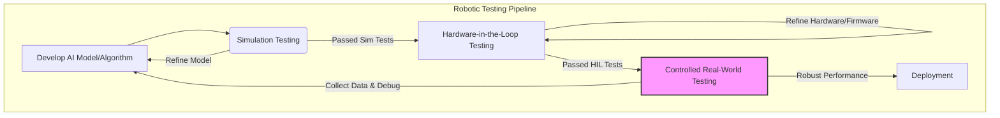

# Chapter 20: Testing, Validation & Debugging

## Introduction

In the complex world of Physical AI and humanoid robotics, ensuring reliability and correctness is paramount. Robots operate in the real world, where errors can lead to physical damage, safety risks, or costly downtime. This chapter explores the critical processes of testing, validation, and debugging for both the AI models and the physical hardware of humanoid robots.

## Testing AI Models on Humanoid Robots

Testing AI models in robotics goes beyond traditional software testing. It involves evaluating the model's performance not just on data, but on its ability to control a physical system reliably and safely.

### 1. Simulation Testing: The First Line of Defense
Before deploying any AI model to a physical robot, extensive testing in simulation is crucial.
-   **Benefits:** Safe, repeatable, fast, and cost-effective. Allows for testing extreme conditions and failure scenarios without risk to hardware.
-   **Methods:**
    -   **Unit Tests for Algorithms:** Verify individual AI components (e.g., a path planning algorithm, an object detection module) against expected outputs.
    -   **Integration Tests in Simulation:** Test how different AI modules interact within the simulated robot (e.g., vision system output feeding into a navigation system).
    -   **Stress Testing:** Simulate challenging environments, rapid changes, or sensor noise to assess robustness.
    -   **Reinforcement Learning Evaluation:** After training, evaluate the learned policy's performance across various simulated scenarios.

### 2. Hardware-in-the-Loop (HIL) Testing
HIL testing bridges the gap between simulation and the real world. The physical robot's control electronics and sometimes even its sensors/actuators are connected to a simulated environment.
-   **Benefits:** Tests the actual robot hardware and firmware with realistic inputs, but without the full physical risks.
-   **Use Cases:** Verifying control loop timing, sensor-actuator synchronization, and hardware responses to simulated events.

### 3. Real-World Testing: Gradual Deployment
When moving to physical robots, testing must be gradual and controlled.
-   **Staged Deployment:** Start with simple, constrained movements in a safe, open environment. Gradually increase complexity and environmental variability.
-   **Teleoperation with Safety Overrides:** Human operators can control the robot while the AI runs in a "monitor mode" or with low authority, allowing for rapid intervention.
-   **Data Collection & Edge Cases:** Continuously collect data from real-world operations to identify edge cases, sensor anomalies, and scenarios where the AI model performs poorly, feeding this back into the development cycle.



## Debugging Sensor and Movement Issues

Robots, by their nature, encounter a myriad of problems that are unique to physical systems. Effective debugging requires systematic approaches.

### 1. Sensor Calibration and Noise
-   **Problem:** Sensor readings are inaccurate, inconsistent, or noisy.
-   **Debugging:**
    -   **Calibration:** Regularly calibrate sensors (e.g., camera intrinsic/extrinsic, IMU bias, force sensor offsets).
    -   **Data Visualization:** Plot sensor data in real-time to identify anomalies or patterns of noise.
    -   **Filtering:** Implement digital filters (e.g., Kalman filter, moving average) to smooth noisy data.

### 2. Actuator Malfunctions and Control Gaps
-   **Problem:** Robot joints don't move as commanded, motors are weak, or movements are jerky.
-   **Debugging:**
    -   **Joint Limit Checks:** Ensure commands are within the physical limits of the actuators.
    -   **Motor Diagnostics:** Check motor temperatures, current draw, and power supply voltage.
    -   **PID Tuning:** For joint controllers, improper PID gains can lead to oscillations (too high Kp, Kd) or slow response (too low Kp, Ki).
    -   **Kinematic/Dynamic Model Verification:** Errors in the robot's internal model (e.g., incorrect link lengths, mass properties) can lead to control inaccuracies.

### 3. Localization and Navigation Errors
-   **Problem:** The robot gets lost, bumps into obstacles, or fails to reach its destination.
-   **Debugging:**
    -   **Map Accuracy:** Verify that the robot's internal map of the environment is accurate and up-to-date.
    -   **Sensor Fusion Issues:** Ensure that data from multiple sensors (LIDAR, camera, IMU) are being correctly combined for state estimation.
    -   **Path Planning Visualization:** Visualize the robot's planned path and actual trajectory to pinpoint where deviations occur.
    -   **Odometry Drift:** Wheel odometry can accumulate errors over time. Implement loop closure (SLAM) or use external absolute positioning systems.

## Comparison of Testing Environments

| Environment | Description | Pros | Cons |
| :--- | :--- | :--- | :--- |
| **Simulation** | Software-only virtual world. | Safe, fast, repeatable, cheap. | "Reality gap", may not capture all real-world physics. |
| **Hardware-in-the-Loop** | Real control hardware with simulated environment. | Tests real electronics, real-time constraints. | Still abstract, not full physical interaction. |
| **Controlled Lab** | Physical robot in a monitored, safe lab. | High fidelity, real physics. | Slow, costly, potential for damage, safety concerns. |
| **Field Deployment** | Real robot in intended operational environment. | Ultimate validation of performance. | Riskiest, most expensive, hard to reproduce errors. |

## Code Example: Simple Unit Test for a Robot Function (Python)

This example shows how to write a basic unit test for a hypothetical robot function that calculates the distance to an obstacle based on ultrasonic sensor readings.

```python
import unittest

class RobotSensors:
    def __init__(self, sensor_offset=0.0):
        self.sensor_offset = sensor_offset # Offset from robot's center to sensor

    def calculate_distance(self, ultrasonic_reading_cm):
        """
        Calculates the true distance to an obstacle based on raw ultrasonic
        reading and sensor offset.
        """
        if not isinstance(ultrasonic_reading_cm, (int, float)) or ultrasonic_reading_cm < 0:
            raise ValueError("Ultrasonic reading must be a non-negative number.")
            
        true_distance = ultrasonic_reading_cm + self.sensor_offset
        return max(0.0, true_distance) # Distance cannot be negative

# --- Unit Tests ---
class TestRobotSensors(unittest.TestCase):
    def test_positive_reading_no_offset(self):
        sensor = RobotSensors(sensor_offset=0.0)
        self.assertAlmostEqual(sensor.calculate_distance(100), 100.0)
        self.assertAlmostEqual(sensor.calculate_distance(0), 0.0)

    def test_positive_reading_with_offset(self):
        sensor = RobotSensors(sensor_offset=10.0) # Sensor 10cm forward of robot center
        self.assertAlmostEqual(sensor.calculate_distance(90), 100.0)
        self.assertAlmostEqual(sensor.calculate_distance(0), 10.0)

    def test_negative_reading_with_offset_should_be_zero(self):
        sensor = RobotSensors(sensor_offset=5.0)
        # If raw reading is -2cm, but sensor is 5cm forward, object is 3cm ahead
        self.assertAlmostEqual(sensor.calculate_distance(-2), 3.0) 
        # If raw reading is -10cm, but sensor is 5cm forward, means object is 'behind' robot or very close
        # In this conceptual example, we clip to 0.0 for physical realism
        self.assertAlmostEqual(sensor.calculate_distance(-10), 0.0) 

    def test_invalid_input(self):
        sensor = RobotSensors()
        with self.assertRaises(ValueError):
            sensor.calculate_distance("invalid")
        with self.assertRaises(ValueError):
            sensor.calculate_distance(None)
        
if __name__ == '__main__':
    print("Running unit tests for RobotSensors...\n")
    unittest.main(argv=['first-arg-is-ignored'], exit=False)

```

## Conclusion

Testing, validation, and debugging are continuous, intertwined processes in robotics development. By adopting a systematic approach—moving from robust simulation to controlled real-world experiments—and by understanding common pitfalls in sensor and movement systems, engineers can build more reliable, safer, and ultimately more capable humanoid robots.
---