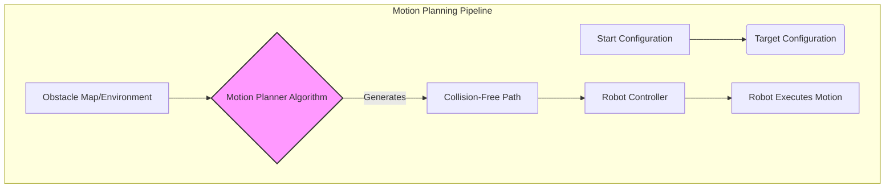

# Chapter 22: Advanced AI Algorithms

## Introduction

As humanoid robots evolve, so does the complexity of the tasks they are expected to perform. This demands increasingly sophisticated AI algorithms that can handle real-world uncertainties, learn complex behaviors, and make intelligent decisions in dynamic environments. This chapter delves into some advanced AI techniques critical for the next generation of Physical AI.

## Motion Planning

Motion planning is the process of finding a sequence of valid configurations (movements) that takes a robot from a starting state to a target state while avoiding obstacles and respecting kinematic and dynamic constraints.

### 1. Sampling-Based Motion Planners:
These algorithms explore the robot's configuration space (the space of all possible joint angles) by randomly sampling points and connecting them to build a roadmap or a tree.
-   **Rapidly-exploring Random Tree (RRT and RRT*):** RRT builds a tree by randomly sampling points and extending the tree towards them. RRT* is an optimized version that aims to find optimal paths.
-   **Probabilistic Roadmaps (PRM):** PRM constructs a roadmap in the free configuration space by connecting randomly sampled valid configurations.

### 2. Optimization-Based Motion Planners:
These methods formulate motion planning as an optimization problem, minimizing a cost function (e.g., path length, energy consumption, time) while satisfying constraints.
-   **Trajectory Optimization:** Directly optimizes the robot's trajectory (sequence of positions, velocities, accelerations) over time.
-   **Model Predictive Control (MPC):** Plans a short trajectory segment, executes the first part, then re-plans based on new sensor data, making it highly adaptive.



## Reinforcement Learning for Complex Tasks

While introduced earlier, Reinforcement Learning (RL) truly shines in its ability to enable robots to learn highly complex, often counter-intuitive behaviors that are difficult or impossible to program manually. Advanced RL techniques push this further.

### 1. Deep Reinforcement Learning (DRL):
Combines deep neural networks with RL. The neural networks act as function approximators for policies (mapping states to actions) or value functions (predicting future rewards).
-   **Deep Q-Networks (DQN):** Learns optimal actions in discrete action spaces.
-   **Proximal Policy Optimization (PPO):** A widely used algorithm for continuous control tasks like robot locomotion, known for its stability and performance.

### 2. Hierarchical Reinforcement Learning (HRL):
Breaks down complex tasks into a hierarchy of sub-tasks. A "high-level" policy sets goals for "low-level" policies, simplifying the learning problem.
-   **Example:** A high-level policy decides "go to kitchen," while a low-level policy figures out how to walk there, handling obstacles.

### 3. Multi-Agent Reinforcement Learning (MARL):
Deals with scenarios where multiple robots (or even parts of a single robot, like limbs) learn to cooperate or compete.
-   **Example:** A team of humanoid robots learning to collaboratively lift a heavy object.

## Comparison of Reinforcement Learning Algorithms

| Algorithm | Type | Action Space | Key Feature | Best For... |
| :--- | :--- | :--- | :--- | :--- |
| **Q-Learning** | Model-Free | Discrete | Simple, table-based (for small states) | Grid worlds, simple games |
| **DQN** | Model-Free, DRL | Discrete | Uses neural networks to approximate Q-values | Atari games, discrete control |
| **Actor-Critic (A2C/A3C)** | Model-Free, DRL | Discrete/Continuous | Learns both policy (actor) and value function (critic) | Continuous control, complex environments |
| **PPO (Proximal Policy Optimization)** | Model-Free, DRL | Continuous | Policy gradient method, stable and sample-efficient | Robotic locomotion, complex control |

## Code Example: Conceptual Pathfinding (A* Search)

While RL learns motion policies, classical pathfinding algorithms are still fundamental for discrete planning. A* search is a popular algorithm for finding the shortest path between two points in a grid while avoiding obstacles.

```python
import heapq

class GridMap:
    def __init__(self, width, height, obstacles):
        self.width = width
        self.height = height
        self.obstacles = set(obstacles) # Set of (x, y) tuples for faster lookup

    def is_valid(self, node):
        """Checks if a node is within bounds and not an obstacle."""
        x, y = node
        return 0 <= x < self.width and 0 <= y < self.height and node not in self.obstacles

    def get_neighbors(self, node):
        """Returns valid neighbors of a node (up, down, left, right)."""
        x, y = node
        neighbors = []
        for dx, dy in [(0, 1), (0, -1), (1, 0), (-1, 0)]: # 4 directions
            neighbor = (x + dx, y + dy)
            if self.is_valid(neighbor):
                neighbors.append(neighbor)
        return neighbors

def heuristic(a, b):
    """Manhattan distance heuristic."""
    return abs(a[0] - b[0]) + abs(a[1] - b[1])

def a_star_search(grid_map, start, goal):
    """Finds the shortest path using A* algorithm."""
    if not grid_map.is_valid(start) or not grid_map.is_valid(goal):
        return None # Start or goal is invalid

    frontier = [] # Priority queue of (f_cost, node)
    heapq.heappush(frontier, (0, start))

    came_from = {} # To reconstruct path
    cost_so_far = {start: 0} # Cost from start to current node

    while frontier:
        current_f_cost, current_node = heapq.heappop(frontier)

        if current_node == goal:
            break

        for next_node in grid_map.get_neighbors(current_node):
            new_cost = cost_so_far[current_node] + 1 # Cost of moving to neighbor is 1
            if next_node not in cost_so_far or new_cost < cost_so_far[next_node]:
                cost_so_far[next_node] = new_cost
                priority = new_cost + heuristic(goal, next_node)
                heapq.heappush(frontier, (priority, next_node))
                came_from[next_node] = current_node
    
    # Reconstruct path
    path = []
    if goal in came_from:
        current = goal
        while current != start:
            path.append(current)
            current = came_from[current]
        path.append(start)
        path.reverse()
    return path

# --- Main Program ---
if __name__ == "__main__":
    # Define a simple grid map (5x5) with obstacles
    obstacles = [(1, 1), (2, 1), (2, 2), (3, 2), (3, 3)]
    grid = GridMap(width=5, height=5, obstacles=obstacles)
    
    start_point = (0, 0)
    goal_point = (4, 4)
    
    print("--- A* Pathfinding Simulation ---\n")
    print(f"Grid Size: {grid.width}x{grid.height}")
    print(f"Start: {start_point}, Goal: {goal_point}")
    print(f"Obstacles: {obstacles}\n")

    path = a_star_search(grid, start_point, goal_point)

    if path:
        print("Path found:")
        for y in range(grid.height):
            row = ""
            for x in range(grid.width):
                if (x, y) == start_point:
                    row += "S "
                elif (x, y) == goal_point:
                    row += "G "
                elif (x, y) in obstacles:
                    row += "# "
                elif (x, y) in path:
                    row += "* "
                else:
                    row += ". "
            print(row)
        print(f"\nPath: {path}")
    else:
        print("No path found.")

```

## Conclusion

Advanced AI algorithms are the driving force behind the growing capabilities of humanoid robots. From sophisticated motion planners that enable agile navigation in complex spaces to powerful reinforcement learning techniques that facilitate the acquisition of intricate skills, these algorithms push the boundaries of what Physical AI can achieve, bringing us closer to truly intelligent and autonomous robotic companions.
---